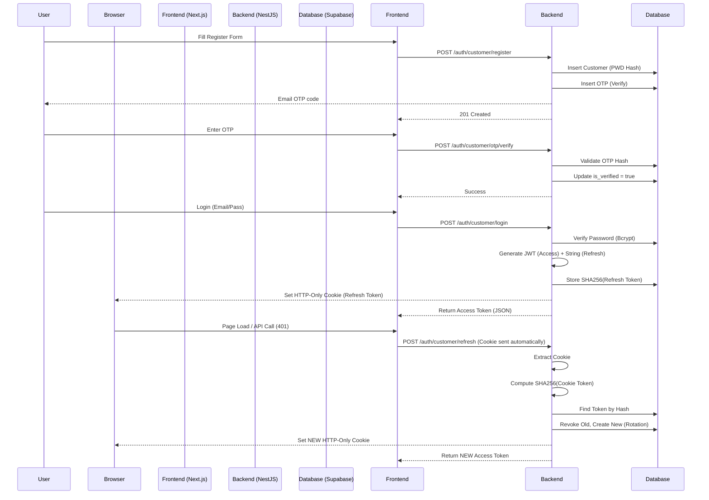

# 🔐 LeBonResto Authentication System: Comprehensive Technical Documentation

## 1. High-Level Architecture
The system implements a **Secure, Double-Token Authentication** strategy (JWT Access Token + Encrypted HTTP-Only Refresh Cookie) with minimal client-side exposure. This design balances security (mitigating XSS/CSRF) with user experience (seamless session persistence).

### 🔄 Authentication Flow Overview

---

## 2. 🗄️ Database Schema & Logic

The authentication system relies on three core tables. We use **Universally Unique Identifiers (UUIDs)** for primary keys and strictly enforce foreign key constraints.

### 2.1. `customers` Table
This is the principal entity. Security-sensitive fields (`password_hash`) are never exposed to the frontend.

| Column | Type | Purpose |
| :--- | :--- | :--- |
| `id` | `uuid` | Primary Key. |
| `email` | `text` | Unique identifier. Indexed. |
| `password_hash` | `text` | **Bcrypt** hash of the user's password. Raw passwords are *never* stored. |
| `is_verified` | `boolean` | Gatekeeper flag. Setup requires OTP verification before this becomes `true`. |

### 2.2. `customer_refresh_tokens` Table
This table handles session persistence. Crucially, **we do not store the raw refresh token**. We store a hash. This means even if the database is leaked, attackers cannot impersonate users because they don't have the original token (which lives only in the user's browser cookie).

| Column | Type | Purpose | Logic |
| :--- | :--- | :--- | :--- |
| `id` | `uuid` | PK | Unique session ID. |
| `customer_id` | `uuid` | FK | Links to the user. `ON DELETE CASCADE` ensures cleanup. |
| `token_hash` | `text` | **SHA256 Hash** | We hash the random token string from the cookie and store it here. To verify, we hash the incoming cookie and search for a match. |
| `expires_at` | `timestamp` | Expiry | Tokens have a long life (e.g., 7 days). |
| `revoked_at` | `timestamp` | Security | Used for "Log out all devices" or Rotation. If present, the token is invalid. |

### 2.3. `customer_otps` Table
Manages One-Time Passwords for Registration and Password Resets.

| Column | Type | Purpose | Logic |
| :--- | :--- | :--- | :--- |
| `customer_id` | `uuid` | FK | The user requesting the action. |
| `otp_hash` | `text` | **Bcrypt Hash**| Even OTPs are hashed! If DB leaks, attackers can't see the 6-digit codes. |
| `purpose` | `text` | Enum | `'verify'` (Registration) or `'reset'` (Forgot Password). |
| `attempts` | `int` | Security | Max 5 attempts. Prevents brute-force guessing of the 6-digit code. |

---

## 3. ⚙️ Backend Implementation (NestJS)

The backend logic is encapsulated in the `CustomerAuthModule`.

### 3.1. `CustomerAuthService` (`customer-auth.service.ts`)
This is the brain of the operation.

#### Key Methods:

1.  **`login(email, password)`**
    *   Finds user by email.
    *   `bcrypt.compare(input_password, stored_hash)`: Validates credentials.
    *   **Generates Tokens**:
        *   `accessToken`: JWT signed with `JWT_ACCESS_SECRET` (15 min). Contains `{ sub: id, email, role }`.
        *   `refreshToken`: A random JWT or string signed with `JWT_REFRESH_SECRET` (7 days).
    *   **Storage**: Calls `hashToken(refreshToken)` -> stores in `customer_refresh_tokens`.
    *   **Returns**: Plain logic object. *Does not touch cookies (Controller does that).*

2.  **`refresh(incomingToken)`**
    *   **Input**: The raw token string from the cookie.
    *   **Validation**: `jwtService.verify(incomingToken)` to check signature and expiry.
    *   **Lookup**: `hashToken(incomingToken)` -> Database Query (`findOneByHash`).
    *   **Security Check**:
        *   Does record exist?
        *   Is it revoked?
        *   Is the user still active?
    *   **Rotation**:
        *   **Revoke** the old token (set `revoked_at = now()`).
        *   **Create** a completely NEW refresh token.
        *   This "Rolling Session" prevents replay attacks. If an attacker stole a token, it would be invalidated the moment the real user used it (or vice-versa).

3.  **`requestOtp(email, purpose)`**
    *   Generates `Math.random` 6-digit code.
    *   Hashes it (`bcrypt`).
    *   Stores in `customer_otps`.
    *   Calls `EmailService` to send the *real* code to the user.

### 3.2. `CustomerAuthController` (`customer-auth.controller.ts`)
Handles the HTTP layer, specifically **Cookies**.

*   **`@Post('login')`**:
    *   Calls `service.login()`.
    *   **Sets Cookie**: `res.cookie('refresh_token', token, { httpOnly: true, secure: true, path: '/' })`.
    *   **Returns Body**: `{ access_token: "..." }`.
    *   *Note: The frontend JS can read the Access Token but CANNOT read the Refresh Token cookie.*

*   **`@Post('refresh')`**:
    *   **Reads Cookie**: `req.cookies['refresh_token']`.
    *   Calls `service.refresh()`.
    *   **Failed?** Clears cookie (`res.clearCookie`) and throws 401.
    *   **Success?** Sets the *NEW* cookie (Rotation) and returns new Access Token.

---

## 4. 🖥️ Frontend Implementation (Next.js)

The frontend is designed to auto-heal sessions.

### 4.1. `AuthProvider` (`AuthProvider.jsx`)
Global Context that holds the user state.

*   **State**: `user` (Object or null), `loading` (Boolean).
*   **Initialization (`useEffect`)**:
    *   Calls `checkAuth` on mount.
    *   `checkAuth` attempts to fetch `/auth/customer/me`.
    *   If this succeeds: User is logged in.
    *   If this fails (401): User is logged out (or `apiClient` failed to refresh).

### 4.2. `apiClient` (`lib/apiClient.js`)
Axios instance with **Smart Interceptors**.

*   **Request Interceptor**:
    *   If we have an `accessToken` in memory, attach it: `Authorization: Bearer <token>`.

*   **Response Interceptor (The Magic)**:
    *   Listens for `401 Unauthorized` errors.
    *   **If 401 happens**:
        1.  Pause the failed request.
        2.  Call `POST /auth/customer/refresh`.
        3.  *Browser automatically sends the HttpOnly Cookie.*
        4.  **Backend** validates and returns a new Access Token.
        5.  `apiClient` saves new Access Token.
        6.  `apiClient` **retries** the original failed request with the new token.
    *   **Result**: The user never knows their session expired. It just works.

### 4.3. `MainHeader` (`MainHeader.jsx`)
Reactive UI component.

*   Uses `useAuth()` hook.
*   **Conditional Rendering**:
    *   `!isAuthenticated`: Shows "Connexion" button.
    *   `isAuthenticated`: Shows User Avatar + Dropdown (Profile, Settings, Logout).

---

## 5. 📂 File Structure Map

| Component | File Path | Responsibility |
| :--- | :--- | :--- |
| **Database** | `migrations/01_customer_auth_tables.sql` | Table definitions. |
| **Backend Service** | `src/modules/auth/customer-auth/customer-auth.service.ts` | Business logic (Hash, OTP, DB interaction). |
| **Backend Controller** | `src/modules/auth/customer-auth/customer-auth.controller.ts` | Cookie management, Route definitions. |
| **Frontend Auth Context** | `apps/web/components/auth/AuthProvider.jsx` | Global state, Login/Register functions. |
| **Frontend API Client** | `apps/web/lib/apiClient.js` | Axios interceptors for auto-refresh. |
| **Frontend Header** | `apps/web/components/header/MainHeader.jsx` | UI display logic. |

---

## 6. How to Debug (Troubleshooting Guide)

| Symptom | Probable Cause | Fix |
| :--- | :--- | :--- |
| **Login works, but Refresh (F5) logs me out** | Browser not sending Cookie. | Check `main.ts` CORS (`credentials: true`, Origin list). Check `apiClient.js` (`withCredentials: true`). |
| **Backend logs "Invalid Refresh Token"** | DB Hash mismatch. | Ensure `customer-auth.service.ts` uses the exact same hash algo (SHA256) for Storage (Login) and Lookup (Refresh). |
| **Backend logs "Refresh token missing"** | Cookie path/domain issue. | Check `controller.ts` cookie options. `path: '/'` is critical. Ensure Frontend/Backend domains match (localhost vs 127.0.0.1). |
| **"Module not found" in Build** | Bad imports. | Check `MainLayout` or page files. Ensure you aren't importing deleted components like `NavbarLight`. |

